

  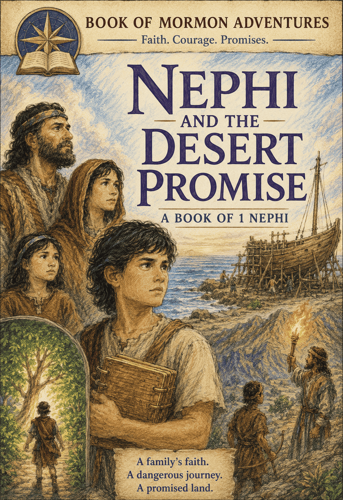

# THE LONG WAY HOME
### The Story of Nephi and His Family

*A retelling of the First Book of Nephi, from the Book of Mormon,
for brave young readers*

---

## A Note Before We Begin

A long, long time ago — about six hundred years before Jesus was born — there really was a boy named Nephi. He lived in the great city of Jerusalem, and then he lived in tents in the desert, and then he sailed across a whole ocean to a brand-new land.

Nephi wrote his own story down on plates of gold so that people would remember it forever. This book tells that story. Some of the small things I have imagined, the way you might imagine what a rainy Tuesday felt like a long time ago. But the big things — the fire, the ship, the shining ball, the tree — those really happened, just as Nephi said.

So find a cozy spot. We are about to take the long way home.

---

## Chapter 1: The Pillar of Fire

  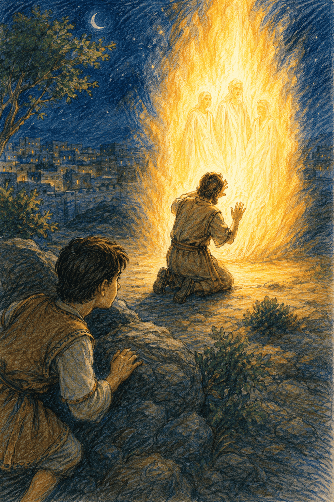 
  <em>Lehi kneels before a pillar of heavenly fire while Nephi secretly watches from the hillside.</em>

Something was wrong with Jerusalem.

Nephi couldn't explain it. But he could feel it, the way you can feel a storm coming before you see a single cloud.

He stood on the flat roof of his family's house and watched the city turn gold in the evening sun. Down below, merchants shouted. Donkeys clopped over the stones. Children darted between the market stalls while their mothers chased after them.

It looked like an ordinary evening.

It wasn't.

"There you are!"

Nephi's oldest brother, Laman, climbed onto the roof, eating a fig. "I've been looking everywhere. Father wants you." He flopped down and popped another fig in his mouth. "What are you staring at?"

"The people," Nephi said. "Listen."

Laman listened. From three different streets came three different arguments — shouting, pointing, fists in the air.

"They fight like that every day now," Nephi said. "It didn't used to be like this."

Laman shrugged. "So people argue. That's what people do."

"Look." Nephi pointed. Down in the square, an old man in a rough robe stood on a step, calling out over the crowd. "That's one of the prophets. He says if the people don't stop being wicked and turn back to God, something terrible is going to happen to the city."

As they watched, a man scooped up a stone and hurled it at the prophet. The crowd laughed.

Laman snorted. "*That's* why nobody listens to prophets."

"Father listens," Nephi said.

"Father listens to *everybody*." Laman rolled his eyes and stood up. "Come on. Supper's ready."

But Nephi stayed a moment longer, watching the old prophet gather his robe and walk away with his head high.

*What if he's right?* Nephi thought.

Something about that made his stomach feel cold.

At supper, Nephi watched his father.

Lehi was usually the loudest one at the table — always laughing, always asking questions, always with a story. But tonight he was quiet. He hardly touched his food. Twice, Nephi's mother, Sariah, asked if he felt well, and both times Lehi just smiled and said, "I'm only thinking."

Then, when the meal was over, Lehi slipped out the door alone into the dark.

Nephi couldn't help it.

He followed.

Keeping to the shadows, he trailed his father out through the city gate and up a lonely hillside. The moon hung over Jerusalem like a silver lamp. Nephi ducked behind a cluster of rocks and held his breath.

Below him, his father knelt down to pray.

It wasn't a quick prayer. It went on and on. And it wasn't a calm prayer, either. Lehi's voice shook.

"Have mercy on them," Nephi heard him beg. "O Lord — have mercy on Jerusalem."

And then the sky *opened*.

A pillar of fire came down out of heaven and stood on a rock right in front of Lehi. It roared straight up toward the stars, brighter than the sun, so bright Nephi had to throw his arm over his eyes.

His heart slammed against his ribs.

*What is happening?*

Inside the fire, shapes moved. Voices spoke — words Nephi couldn't quite hear. His father fell forward with his face to the ground, trembling.

Then, as quickly as it had come, the fire was gone.

The hillside was dark again. Quiet again. As if nothing had happened at all.

But something had.

Nephi's father stayed on his knees, weeping — though not from fear. Nephi crept out from behind the rocks. He couldn't stop himself.

"Father?" he whispered.

Lehi looked up. And Nephi caught his breath.

His father's face was *shining*.

"You saw it," Lehi said softly. It wasn't a question.

Nephi nodded. He could barely speak. "What — what *was* that?"

Lehi rose slowly and put his hands on Nephi's shoulders. His eyes were wet, but they were full of wonder.

"The Lord showed me things tonight, my son. Wonderful things. And terrible things." He looked back toward the sleeping city. "Jerusalem is in danger, Nephi. The people have grown so wicked that unless they change their hearts, this city — all of it — will be destroyed."

Nephi felt cold all over. "Destroyed? *Jerusalem?* But it's the strongest city in the world."

"No city is stronger than God," said Lehi gently. "That is why He showed me. He wants me to warn them. To give them one more chance."

Nephi looked up at his father — his kind, ordinary father, who listened to everybody — and understood, all at once, that nothing about their family was ordinary anymore.

"They won't like it," Nephi said quietly, remembering the stone flying at the prophet in the square. "The people. When you warn them. They won't like it at all."

Lehi didn't answer.

And somehow, that frightened Nephi most of all.

---

## Chapter 2: The Warning

  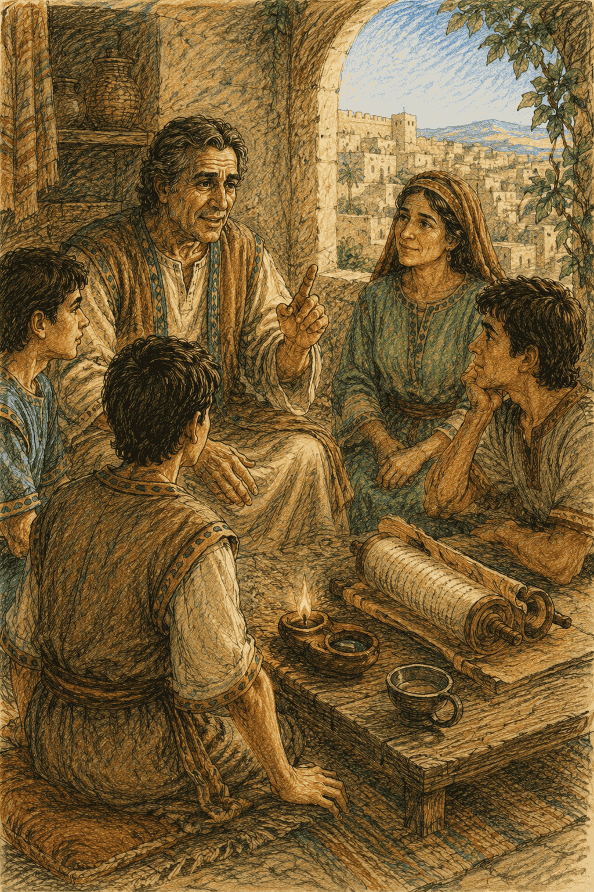 
  <em>Lehi tells his family they must leave Jerusalem and abandon everything they own.</em>

The next morning, Lehi did the bravest — and most dangerous — thing Nephi had ever seen.

He went to preach.

Nephi followed him into the heart of the city, where the streets were most crowded. Sam came too. So did Laman and Lemuel, though only because Mother made them.

Lehi climbed up where everyone could see him.

"People of Jerusalem!" he called. "The Lord has shown me a vision! Turn back to Him — be honest, be kind, remember God — or this city will be destroyed!"

The crowd slowed.

Then it laughed.

"It's that man again!"

"A vision! He says he's seen a *vision!*"

"Go home, old man!"

Nephi's cheeks burned. He balled his fists. But Sam caught his arm.

"Look at Father," Sam whispered. "He's not even angry."

He was right. Lehi kept pleading, gently, almost in tears — and the gentler he was, the angrier the crowd grew.

Then a hard voice near the front said, "Someone should silence him. For good."

Hands reached for stones.

"Father!" Nephi grabbed Lehi's robe. "We have to go — *now!*"

They pulled him out of the square and hurried home, the shouts of the mob chasing them all the way.

That night, no one lit a lamp.

The family sat together in the dark. Sariah held Lehi's hand tightly.

"They mean it," she said. "They'll hurt you. Maybe worse."

"I know," Lehi said softly.

"Then what do we do?"

For a long moment, Lehi was quiet. Then he said, "God has already told me."

Everyone leaned in.

"In a dream, the Lord spoke to me. He said I have been faithful — but the people want to take my life." Lehi looked around at each of them. "He commanded us to leave Jerusalem. To go out into the wilderness. Tonight."

The room burst into whispers.

"Leave?" said Laman. "Leave and go *where?*"

"God will lead us," said Lehi.

"For how long?"

"I don't know."

"And what about the house?" Lemuel demanded. "Our gold? Our silver? All our *things?*"

"We leave them," said Lehi.

Laman's mouth fell open. "You're walking away from your *treasure?* Into the *desert?*"

Lehi rose to his feet. His voice was kind, but it left no room for arguing. "Our treasure won't save us. God will. Pack only what we can carry. We go before the sun comes up."

Nephi looked at his father's calm, shining face, and then at his brothers' angry ones, and felt his heart pull two ways at once.

He was scared. Of course he was scared.

But he was something else, too.

He was curious. Where in all the world was God about to take them?

They slipped out through the city gate while it was still dark.

Nephi looked back only once. Jerusalem stood gray and silent behind them, its walls and towers black against the last of the stars. He had lived there his whole life. He wondered if he would ever see it again.

Then he turned and followed his family into the wild.

The desert was not kind.

By day, the sun beat down like a hammer. By night, the cold crept into their bones. Their soft city sandals wore thin. They slept in tents on the hard ground.

And Laman and Lemuel complained about every single step.

"My feet are bleeding."

"I'm starving."

"This is madness. We traded a house for a pile of *sand.*"

"Father heard God," Nephi told them.

Laman laughed. "Father heard a *dream*, Nephi. There's a difference."

But Lehi never turned back. Day after day, he led them south, along the shore of the Red Sea, following wherever the Lord told him to go.

And after many days, they came at last to a valley — a *green* valley, with a river running cold and clear down its middle.

After all that burning sand, it looked like the most beautiful place in the world.

"We'll camp here," said Lehi. And he smiled for the first time in days. "Here, we'll rest."

But their rest would not last long.

Because God was not finished giving commandments.

---

## Chapter 3: I Will Go and Do

  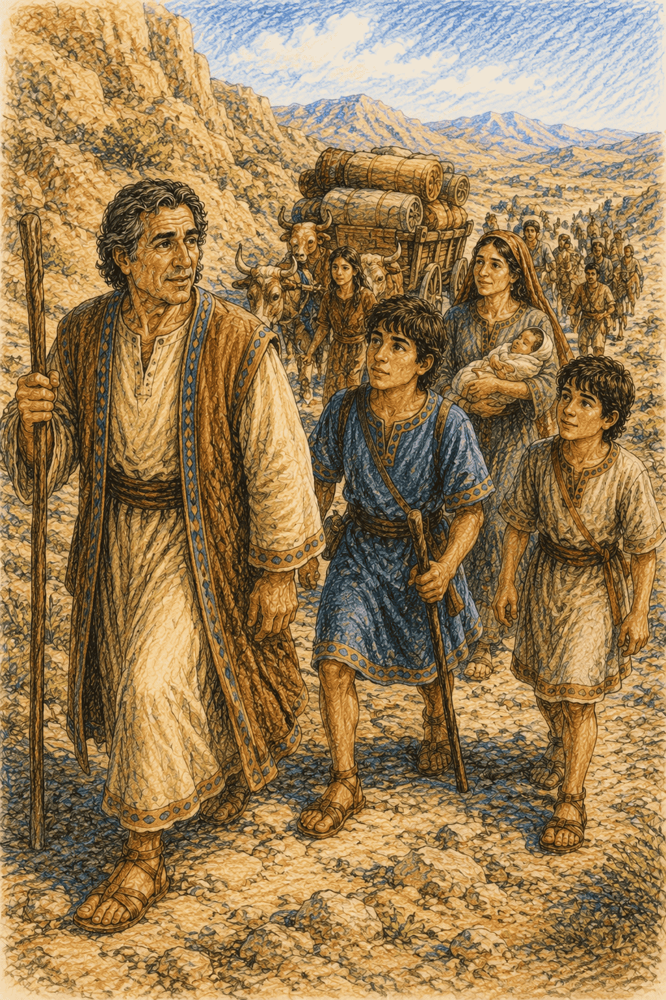 
  <em>Nephi and his brothers begin the dangerous journey back to Jerusalem for the brass plates.</em>

Lehi loved the little valley so much that he decided to give everything in it a name.

"This river," he announced, "I'll call Laman." He put his hand on his oldest son's shoulder. "Laman — I wish you could be like this river. Always running toward God, and never stopping."

Laman shrugged the hand away.

"And this valley," said Lehi, "I'll call Lemuel. Lemuel, I wish you could be like it — strong and steady, standing firm no matter what."

Lemuel just stared at his feet.

Nephi watched, and his heart ached. *Why won't they believe?*

Then a harder question crept into his mind.

*Do I believe? Really believe? Or do I only believe because Father does?*

He had to know for himself.

So that night, Nephi walked a little way out under the huge desert sky. He knelt down, and he prayed with all his heart.

*God,* he said silently, *is it true? Is my father really Your prophet? I have to know. Please — soften my heart. Let me know for myself.*

And something happened.

A warmth spread through Nephi's chest, gentle and sure, like sunlight on a cold morning. It filled him all the way up. And a voice — quieter than a whisper, but clearer than a bell — spoke to his heart.

*Yes. It is true. Be faithful, and I will lead you.*

Nephi opened his eyes. The stars blurred, because he was crying — but they were happy tears.

He knew. Now he really knew.

He ran back to camp and found Sam by the fire. "Sam — I prayed, and God answered me. Everything Father said is true."

Sam looked at his little brother's shining face. Then he smiled. "I believe you."

But when Nephi told Laman and Lemuel the same thing, Laman only yawned.

"You *prayed*," he said. "You *felt warm*. Nephi, you'll believe anything."

Nephi didn't argue. Some things you can't argue a person into. You can only know them for yourself, the way he now did.

A few days later, Lehi gathered his four sons close.

"The Lord has spoken to me again," he said. "And this time, it's a hard one."

Nephi leaned in.

"We can't build a new life without something we left behind in Jerusalem," Lehi said. "Something more precious than all our gold."

"What could be more precious than gold?" asked Lemuel.

"The scriptures," said Lehi.

He explained. Back in Jerusalem lived a rich and powerful man named Laban. Laban kept a set of plates made of brass — sheets of metal engraved with the holy writings. The words of the prophets. The history of their own family. The commandments of God.

"If we go into the wilderness without those words," Lehi said, "our children will forget them. They'll forget who they are. They'll forget God." He looked at his sons. "You must go back to Jerusalem, and bring me the plates of brass."

Silence.

Then Laman exploded. "Go *back?* To the city that wants us *dead?* To ask *Laban* — the meanest, richest, most dangerous man in Jerusalem — to just *hand over* his treasure?" He threw up his hands. "It's impossible!"

Lemuel nodded hard. "It can't be done."

Everyone looked at the ground.

Somebody had to say something.

So Nephi stood up.

And he said the words he would live by for the rest of his life:

"I will go and do the things which the Lord has commanded."

His brothers stared.

"Because I know," Nephi went on, "that God never gives us a commandment without preparing a way for us to keep it."

Lehi's eyes filled with tears.

And so, the very next day, the four brothers set out — back toward the city they had only just escaped.

---

## Chapter 4: The Angel in the Cave

  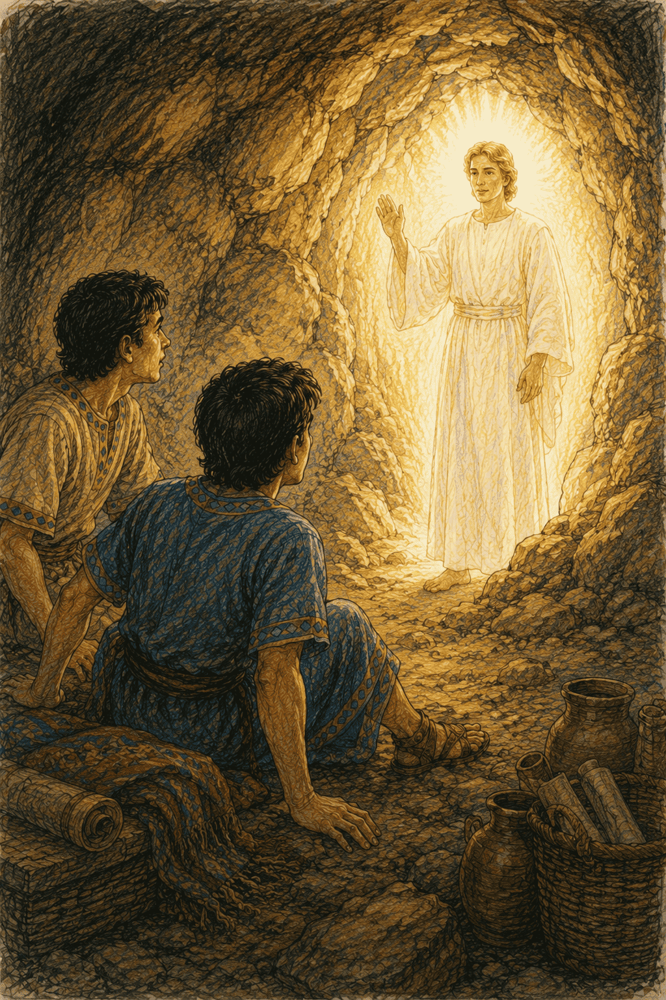 
  <em>A brilliant angel appears in the dark cave after Laman and Lemuel attack Nephi and Sam.</em>

Outside the walls of Jerusalem, the brothers stopped to make a plan.

"We'll draw lots," said Laman. "Whoever gets picked has to go ask Laban."

They drew lots.

The lot fell on Laman.

His face went pale. But a promise was a promise. So he squared his shoulders and marched into the city, all the way to Laban's grand house, with its guards and its high stone walls.

The others waited outside, hearts pounding.

Inside, Laman found Laban sitting like a king.

"Um. Hello," said Laman. "We've — that is — my father sent us. For the brass plates. Please."

Laban's eyes narrowed. "The *plates?* My family's records?" He rose from his chair, his face turning red. "You're a thief! You've come to rob me! GUARDS!"

Laman did not wait to explain. He ran — out the door, down the street, through the gate — and didn't stop until he reached his brothers.

"He called me a robber!" Laman gasped. "He nearly killed me! That's it. We tried. Let's go home."

"Agreed," said Lemuel, already turning to leave.

"No." Nephi grabbed Laman's arm. "We made a promise. Not to Father — to *God*. And I have an idea."

Laman yanked his arm free. But he listened.

"Remember all the gold and silver Father left in our house?" said Nephi. "It's still there. Laban won't *give* us the plates — but maybe he'll *trade* them. For treasure."

Laman scratched his chin. "That… might actually work."

So they crept to their old, empty home. And there it all was — chests of gold, heaps of silver, gleaming in the dust. Everything their father had walked away from.

They gathered it up and carried it straight to Laban.

"Laban!" Nephi bowed low. "We don't want to fight. We want to *buy* the plates. Look — gold, silver, all of it! A fair trade."

Laban's eyes went wide and greedy. They darted over the piles of treasure.

And then he did a wicked thing.

"Guards!" he shouted. "Throw these boys out — and keep the gold!"

"RUN!" Nephi cried.

They dropped everything and fled for their lives, Laban's soldiers pounding after them with swords drawn. They didn't stop until they scrambled, gasping, into the dark mouth of a cave in the hills.

Now they had nothing.

No plates. And no treasure, either.

Laman turned on Nephi, shaking with rage. "This is YOUR fault!" He snatched up a stick and began to beat Nephi and Sam. "Your stupid idea! We should never have listened to you!"

Nephi curled up, arms over his head. His eyes stung — not just from the blows, but from the meanness of it.

And then the cave lit up.

Nephi looked up.

A man stood in the cave. A man made of light.

An *angel*.

Laman dropped the stick. Lemuel's mouth fell open. No one moved. No one breathed.

The angel's voice was gentle, but it filled the whole cave.

"Why do you beat your younger brother?" he asked Laman and Lemuel. "Do you not know that the Lord has chosen him to lead you — because of your grumbling?"

Then the angel looked at all of them.

"Go up to Jerusalem again," he said. "And this time, the Lord will deliver Laban into your hands."

And then he was gone. The light folded up like a closing door, and the cave was dark once more.

For a long moment, nobody spoke.

Then Laman found his voice. And even *now*, he complained.

"'Deliver Laban into our hands'? *How?* He commands fifty soldiers. Maybe more. How can we possibly—"

"Did you not just see an *angel?*" Nephi said, getting to his feet. His arms still ached. But his voice was steady. "God is stronger than Laban. Stronger than fifty soldiers. Stronger than all the armies in the whole world. Let's go up again — and let's be faithful."

He looked out of the cave, toward the dark towers of the city.

"I don't know yet exactly how we'll do it," he said.

"But I'm going to go and find out."

And this time, he would go alone.

---

## Chapter 5: The Bravest Night

  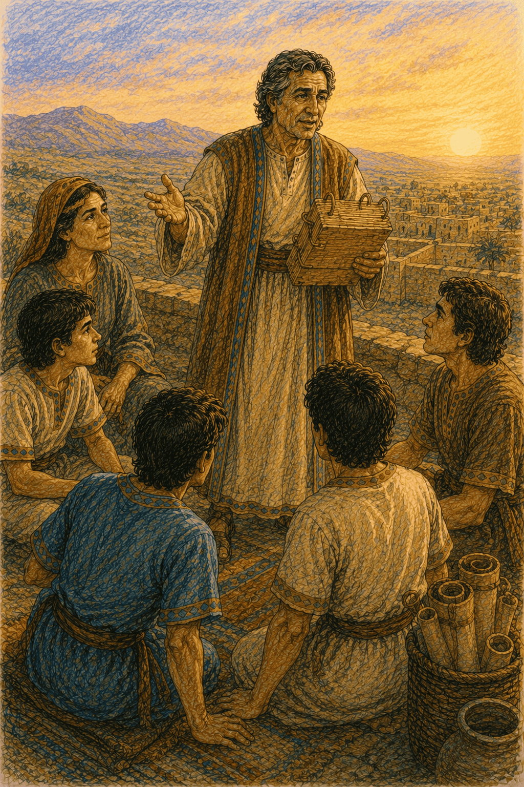 
  <em>Lehi joyfully examines the recovered brass plates as the family gathers around him.</em>

The city was fast asleep.

Nephi crept through the dark, empty streets, his heart drumming. He had no plan. He didn't know what would happen next.

He only knew what the angel had said — and that God would show him the way, one step at a time.

*I was led by the Spirit,* Nephi would write later, *not knowing beforehand the things which I should do.*

That is a brave way to walk. One step. Then the next. Trusting God for the rest.

He crept toward Laban's great house. And there, in the middle of the empty street, his foot bumped into something.

Not something. *Someone.*

A man lay sprawled on the ground, snoring. Nephi bent close in the moonlight — and froze.

It was Laban.

Laban had been out feasting and drinking with the rich men of the city, and now he lay in the street, sound asleep and unable to wake. Beside him lay his sword. Nephi had never seen anything like it — the handle was pure gold, the blade shone like water in the moonlight.

And into Nephi's heart came a whisper. The same quiet, powerful voice from the desert.

*The Lord has delivered Laban into your hands.*

Then the whisper said something that made Nephi's hands shake.

*You must take his life.*

"No," Nephi breathed. "Please. I've never hurt anyone. I don't want to."

But the voice came again — patient, and sure.

*Laban is a wicked man. He stole from you. He tried to have you killed. And the Lord knows what is coming. If you do not do this, your whole family — and all the thousands and thousands of people who will one day come from you — will grow up without the scriptures. They will forget God. It is better that one man should perish than that a whole nation should forget the Lord.*

Nephi understood.

This was the only way to save the holy words — the words his family, and all their children, and all their children's children, would need to remember God. God had promised. And God could see what Nephi could not.

So Nephi did the hardest thing he had ever done.

He obeyed.

Quietly, when it was over, he dressed himself in Laban's clothes and armor, and fastened the golden sword at his side. In the dark, dressed as Laban, he looked just like the master of the house.

Then he walked straight up to the treasure room where the brass plates were kept.

A servant stood guarding the door. His name was Zoram, and he held the keys.

Nephi made his voice low and gruff. "It's me — Laban. Fetch the brass plates. We're taking them to my brothers, outside the city walls."

Zoram bowed at once. "Yes, master." He unlocked the room, gathered up the heavy plates, and walked out through the city gates beside Nephi — chatting the whole way, never once guessing that the man beside him wasn't Laban at all.

But when they reached the dark hills, Nephi's brothers saw him coming — dressed as Laban! — and shrieked and ran.

"Wait!" Nephi called out in his own voice. "It's me! It's Nephi!"

Zoram jumped back in terror. This wasn't Laban! He spun to run —

But Nephi was big and strong, and he caught him and held on.

"Please — don't be afraid!" Nephi said quickly. "I promise, on my life: come with us into the wilderness, and you'll be free. You'll be part of our family. No one will ever hurt you."

Zoram stopped struggling. He looked into Nephi's honest face. And he made a choice that changed his whole life.

"I'll come with you," he said.

And from that night on, Zoram wasn't a servant anymore. He was a friend. He was a brother.

The brothers hurried back through the wilderness with the precious plates. And when they came into camp, Sariah ran to them and threw her arms around them, crying and laughing at the same time.

"My boys," she wept. "You're alive. You're all alive!" She had been so afraid they had been killed that she'd nearly lost hope. "And you have the plates. You truly have them!"

That night, Lehi gave thanks to God until the fire burned low.

Nephi had done the thing the Lord commanded.

Just as he said he would.

---

## Chapter 6: The Ropes

  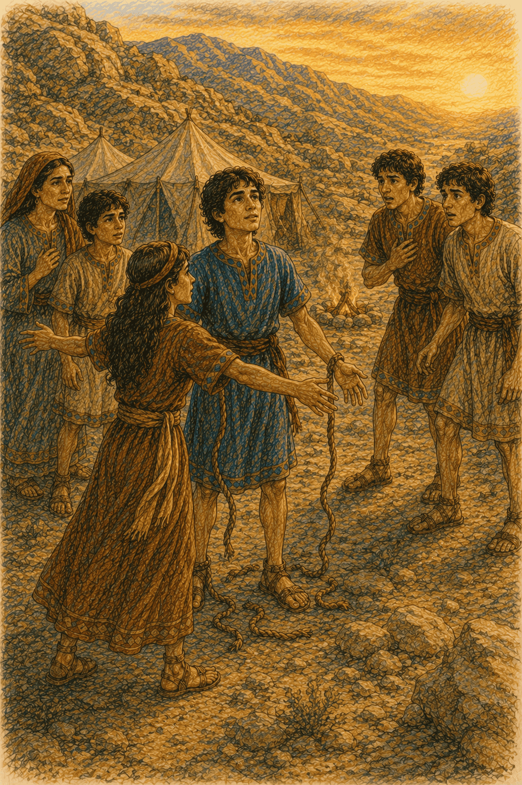 
  <em>Nephi breaks free from his ropes as Ishmael's daughter steps forward to protect him.</em>

You'd think that after all that, the family could finally rest.

But Lehi called his sons together again.

"My boys," he said gently, "one day, each of you will want a family of your own. But out here, there's no one to marry." He smiled. "So the Lord has told me what to do. Back in Jerusalem lives a good man named Ishmael. He has a wife, and sons — and daughters. Go and invite his whole family to join us."

This time, nobody complained.

(A journey to meet some *daughters* sounded a great deal better than a journey to face Laban.)

So the brothers traveled back to Jerusalem one more time. And God softened Ishmael's heart. When the brothers explained everything, Ishmael and his wife and all their children agreed to leave the city and come along.

It was a big, happy group that set out into the desert together.

But happiness, it turned out, did not last the whole way.

The road was long. The sun was hot. And soon Laman and Lemuel started up their old, grumbling song — only now, some of Ishmael's family joined in, too.

"Why did we ever leave Jerusalem?"

"We had houses. We had gardens."

"Let's just turn around and go home!"

Nephi couldn't stay quiet.

"How can you forget so fast?" he pleaded. "You've *seen* an angel. You've *heard* the voice of God. You know Jerusalem is going to fall. Why would we go back to a city that's about to be destroyed? Remember what God has done for us — remember, and have faith!"

But his words only made Laman angrier.

"You think you're better than us," Laman snarled. "You think you should be our ruler. Our little teacher. Well — we've had enough."

And Laman and Lemuel grabbed Nephi.

They tied his hands and feet with rough cords, so tight the ropes cut into his skin. They meant to leave him there in the wilderness — for the wild animals.

Nephi didn't scream. He didn't curse his brothers.

He closed his eyes, and he prayed.

*O Lord,* he prayed, *please — give me strength to break these cords.*

And warmth flooded into his arms and legs — a strength that was not his own.

He pulled.

He strained.

And the thick ropes snapped like threads.

Nephi stood up. Free.

Laman and Lemuel stared, half amazed and half furious. They lunged for him again —

— but this time, others rushed in between. Sam. And Ishmael's wife. And one of Ishmael's daughters, who planted herself right in front of Nephi with her arms spread wide.

"Stop it!" she cried. "Leave him alone! Haven't you done enough?"

Slowly, the fury drained out of Laman's face.

And then something strange happened.

Laman was *ashamed*. He hung his head. And he asked Nephi to forgive him.

Here's the part that's hardest to believe.

Nephi did.

He didn't yell. He didn't get even. He wrapped his sore, aching arms around his big brother, and forgave him with his whole heart, and prayed that God would forgive him too.

Because that's what God is like.

And more than anything in the world, Nephi wanted to be like God.

That night, around a peaceful fire, old Lehi had something to share.

"Last night," he said, his eyes twinkling, "I had a dream. The most wonderful dream of my whole life."

He leaned in close. The firelight danced on every face.

"Come close," he said. "Let me tell you… about a tree."

---

## Chapter 7: The Tree of Life

  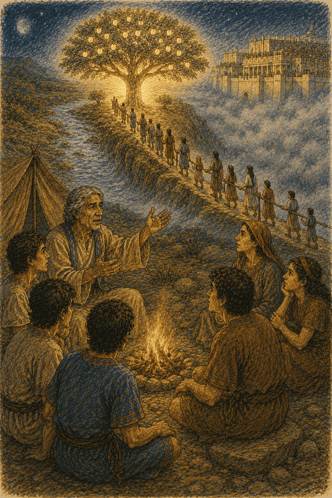 
  <em>Lehi tells his dream by the campfire as the Tree of Life, iron rod, and great building appear above.</em>

Everyone leaned in. Even the crickets seemed to hush.

"In my dream," Lehi began, "I was walking in a dark and empty place, all alone. I walked for hours. I couldn't find my way. So I prayed. And then — I saw it."

"Saw what, Father?" asked Sam.

"A tree," said Lehi. "The most beautiful tree in all the world. Its fruit was white — whiter than snow — and it *glowed*. Just looking at it made me happy. So I picked the fruit, and I tasted it."

He closed his eyes, remembering.

"Oh, my children. It was the sweetest thing I have ever tasted. Sweeter than honey. And it filled me right up with joy — a joy so big that the only thing I wanted was to share it. So I looked around for all of you."

"Did you find us?" Nephi asked.

"I found a river. And a narrow path beside it, leading to the tree. And along the path there was a *rod of iron* — a strong railing — that you could hold on to." Lehi's voice dropped. "But then a mist came. A thick, cold fog of darkness, rolling in. It was so thick that people got lost in it. They couldn't see the tree. They couldn't see the path. Some of them let go of the rod and wandered off into the dark, and were lost."

Everyone shivered.

"But the ones who *held on*," Lehi went on, "the ones who kept one hand on that iron rod and never let go, no matter how dark it got — *they* made it through. They reached the tree. And they tasted the fruit, and were filled with joy."

Then Lehi's face grew sad.

"There was one more thing. Across the river stood a great and spacious building, floating high in the air, with no foundation at all. It was full of people in fancy clothes. And they were *laughing*. Pointing. Making fun of everyone at the tree. And some of the people who had already tasted the fruit heard the laughing… and felt ashamed… and let go of the rod, and wandered away, and were lost too."

The fire crackled.

"Hold to the rod, my children," Lehi whispered. "Whatever happens. Hold on."

Now, Nephi had listened to every single word. And a great hunger woke up inside him.

*I want to see it too,* he thought. *Not just hear about it — see it. Understand it. For myself.*

So Nephi went off alone and prayed to understand his father's dream. And because he asked with real faith, God showed him the very same vision — and explained what everything meant.

An angel carried Nephi away in the Spirit and showed him wonderful things. He saw, far away in the future, a young woman in a town called Nazareth. Her name was Mary. And Nephi watched her hold a baby in her arms.

"Look, Nephi," said the angel. "This is the Son of God. His name is Jesus. He is the Savior of the whole world."

And suddenly, Nephi understood.

"The tree," the angel explained, "is the love of God. And its sweet fruit is the greatest gift of all — the gift of Jesus, and His love, which fills us with joy."

"And the iron rod?" Nephi asked.

"The iron rod is the *word of God* — the scriptures, and His commandments. Hold tight to God's word and never let go, and it will lead you straight through the darkness — all the way to Jesus."

"And the mist?"

"The mist of darkness is temptation — everything that tries to make you forget God and lose your way. And the great and spacious building is the *pride* of the world: people who think they are too rich, too clever, and too important to need God, and who laugh at those who love Him." The angel looked at Nephi kindly. "But that building has no foundation. In the end, it will fall — and all their laughing will fall with it."

Nephi came back to camp with his eyes wide and his heart on fire.

Now he understood.

It wasn't just a pretty dream about a tree.

It was a map. A map that showed the way home — all the way home to God.

And Nephi meant to hold on to that iron rod, with both hands, for the rest of his life.

---

## Chapter 8: The Shining Ball

  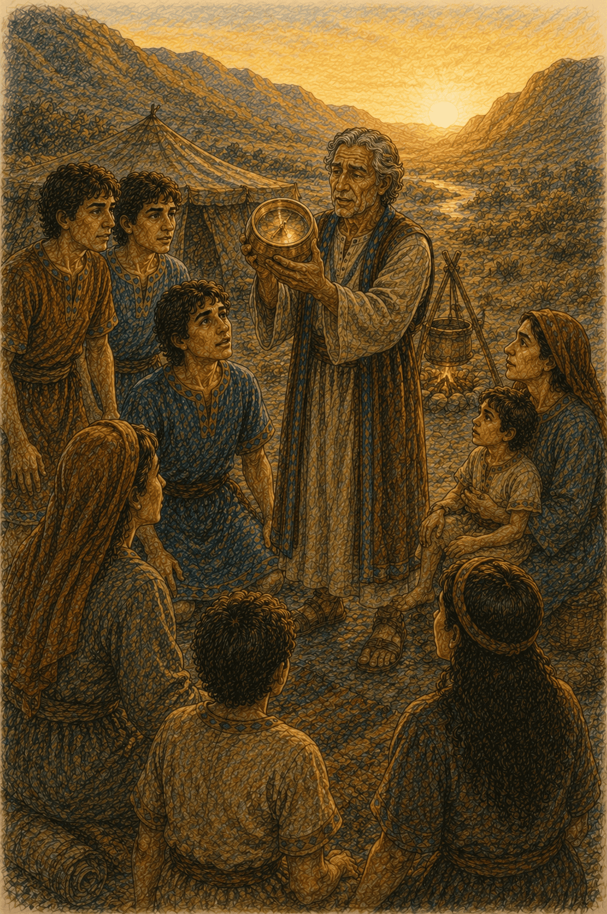 
  <em>The family marvels as Lehi discovers the miraculous Liahona outside his tent.</em>

One morning, Lehi stepped out of his tent — and stopped.

Something was sitting on the ground, right in front of the door.

"Nephi," he called. "Come and see this."

It was a ball. Round, made of polished brass, and beautiful. Inside it were two thin pointers, like the needles of a compass. And as Lehi lifted it, one of the pointers swung around — and showed the way they should travel.

"Where did it come from?" Nephi asked.

"No one made it," said Lehi softly. "No one left it here. God gave it to us."

Later, the family would call it the *Liahona*.

But the Liahona had a secret.

It only worked by faith.

When the family trusted God, and were kind, and did what was right, the pointers pointed clear and true. But when they grumbled and fought and forgot God — the pointers stopped. They just went still. And the family got lost.

"Isn't that something?" Nephi said one day, turning it over in his hands. "A little ball. And it does great things — but only when we believe."

Guided by the Liahona, the family traveled on. And on. And on. It was a hard journey. They didn't dare light many fires, so often they ate their meat raw. Sometimes they were so tired and hungry they could barely stand.

And then, one terrible day, disaster struck.

Nephi's bow broke.

Snapped clean in two.

Now, Nephi was the family's best hunter, and that fine steel bow was how he found food for everyone. Without it — there would be nothing to eat.

The whole camp fell into despair. And this time, you'll hardly believe it: even the *good* people grumbled. Even faithful old Lehi, weak with hunger and worn right out, complained against the Lord.

Everyone was cold. Everyone was starving. Everyone was afraid.

But Nephi didn't sit down and cry. And he didn't join the grumbling.

He got to work.

He found a straight branch of wood, and slowly, patiently, he carved it into a brand-new bow. He made an arrow to match.

Then he did something that must have surprised everyone.

He walked up to his father — his father, who had been grumbling — and asked, humbly:

"Father, you're our prophet. Where should I go to find food?"

The question melted Lehi's heart.

He was so ashamed of his complaining that he bowed his head and prayed and told God he was sorry. And God answered — new writing appeared on the Liahona, showing Nephi exactly where to go.

Nephi followed the ball high up a mountain with his little wooden bow. And there — he found animals, and hunted them, and came back with so much food that the whole camp feasted and gave thanks.

Even Laman and Lemuel were humbled. They saw that Nephi had kept his faith when everyone else — even Father — had lost theirs.

But sorrow was not finished with them yet.

As they traveled on, kind old Ishmael — the father of the daughters, the grandfather of the whole group — grew sick. And out there in the wilderness, far from home, he died.

His daughters wept and wept. They were so heartbroken and homesick that some of them cried out to go back to Jerusalem, no matter what. And in their grief and their anger, Laman and Lemuel even plotted to hurt Lehi and Nephi again.

But God spoke to them with His voice, and they were afraid, and they stopped.

So the family buried good Ishmael. They dried their tears. And they pressed on.

They were tired. They were sad. They had been traveling for *years*.

And then, one day, they came over a rise —

— and heard a sound none of them had heard in a very, very long time.

The crash and the roar of ocean waves.

---

## Chapter 9: Building the Ship

  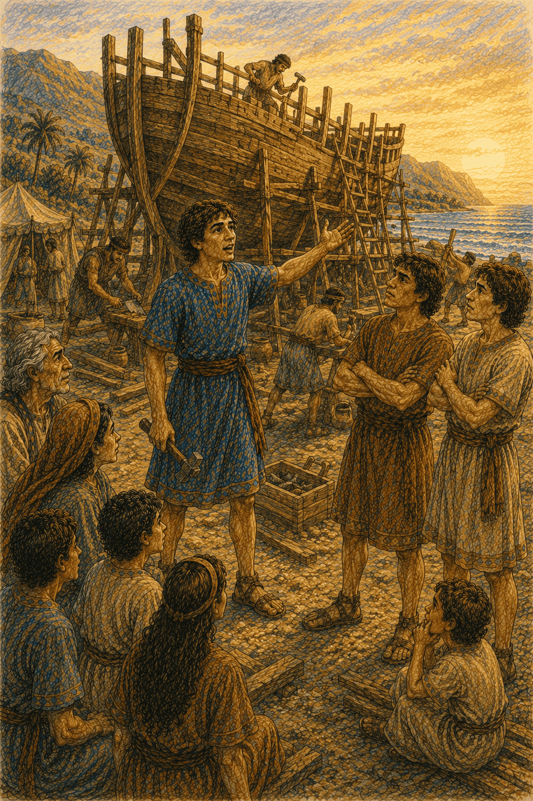 
  <em>Nephi boldly defends God's command as the great ship rises on the shores of Bountiful.</em>

The land by the sea was so beautiful that the family named it Bountiful — because it had everything.

Fruit trees. Wild honey. Fresh water. And a wide, sparkling ocean that stretched all the way to the edge of the world.

After years in the desert, it felt like paradise. The family rested. They ate until they were full. They laughed again.

And Nephi, grateful all the way down to his toes, climbed a mountain to pray and thank God.

And on that mountain, God gave Nephi the most astonishing job of his whole life.

*Nephi,* said the Lord, *build a ship. In it, you will carry your family across the sea, to the promised land I have prepared for you.*

Nephi's mouth fell open.

A *ship?*

He had never built a ship. He'd never even built a *boat*. He had no idea how!

But by now, Nephi had learned the secret to doing impossible things.

You don't start with "I can't."

You start with a question.

"Lord," Nephi asked, "where can I find ore, to make tools?"

And God showed him.

Nephi found ore in the mountainside. He built a fire, and made a bellows out of animal skins to blow the flames white-hot, and melted the metal, and shaped it into tools. And step by step, day by day, God showed him exactly how to build the ship — not the way men built ships, but a far better way. God's way.

But when Laman and Lemuel saw their little brother sawing and hammering, they didn't help.

They *laughed*.

"Look at him!" they hooted from the shade. "He thinks he's a shipbuilder! He's going to drown us all. Nobody can cross that ocean. He's lost his mind — just like Father."

Nephi turned to face them. And this time, he did not stay quiet.

"You're just like the people back in Jerusalem," he said, and his voice rang out. "You've seen an angel! You've heard the voice of God! He split the Red Sea for Moses. He led our ancestors out of Egypt with a pillar of fire. Do you really think He can't help us build a ship? Nothing is too hard for the Lord!"

Laman and Lemuel jumped up, red-faced, and rushed at him to throw him into the sea.

"In the name of God," Nephi commanded, holding up his hand, "do not touch me!"

And something happened that stopped his brothers cold.

Nephi was filled with the power of God — so full that he seemed to shine.

"If you lay one finger on me," he said, and his voice shook the air, "you will wither like a dried-up plant. For the power of the Lord is with me."

Laman and Lemuel could not move.

They were too afraid even to touch him.

At last, God told Nephi to reach out and touch his brothers — and when he did, a jolt like lightning ran through them, so they would *know*, once and for all, that the power was real, and that it came from God.

And it worked. For a while, at least. Laman and Lemuel stopped mocking. They picked up tools.

And the whole family — together at last — built the ship.

When it was finished, they stood back and looked at it, bobbing on the bright water.

It was *magnificent*.

Even Laman and Lemuel had to admit it: their little brother's ship was finer than anything the greatest builders in Jerusalem could have made.

"It's beautiful," Sam breathed.

Nephi smiled up at his ship. Then he looked out at the endless, glittering sea.

"Come on," he said. "Let's load it up." He grinned. "God is taking us home."

---

## Chapter 10: The Storm at Sea

  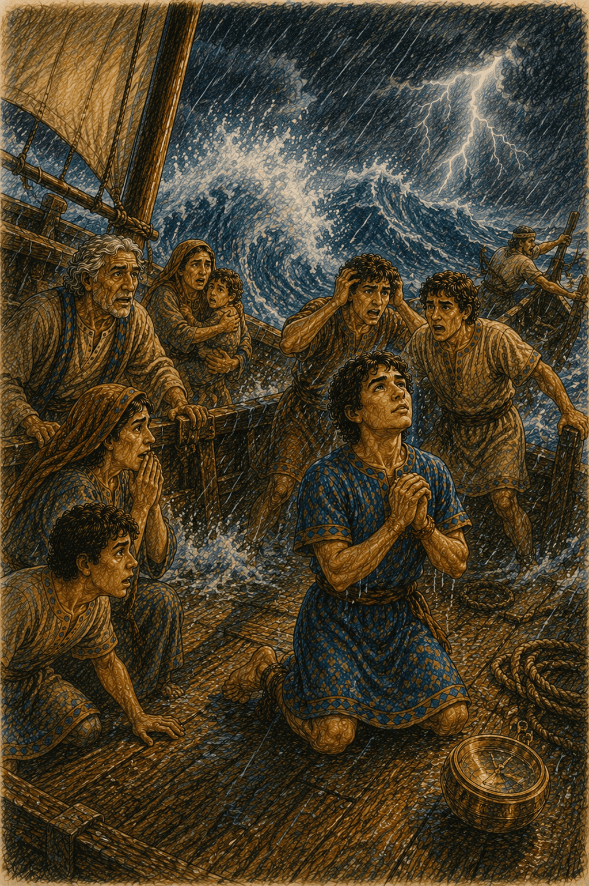 
  <em>A violent storm batters the ship as Nephi prays and the terrified family struggles against the waves.</em>

They packed the ship with everything they'd need — fruit, meat, honey, and seeds to plant in the new land.

Then everyone climbed aboard.

Lehi and Sariah, gray now, and older. Laman, Lemuel, Sam, and Nephi. Zoram. Ishmael's family. And all the children, who had never in their lives seen anything as exciting as the deep blue sea.

They let down the sails. The wind filled them. And the great ship glided out onto the ocean, toward the promised land.

For many days, it was wonderful.

The Liahona pointed the way. The wind was gentle. Dolphins leaped alongside. The children laughed.

But far out in the middle of that huge ocean, with no land in sight in any direction — Laman and Lemuel forgot God again.

They began to throw a party. A wild, rude party, with dancing and shouting and mean jokes.

Nephi was worried.

"Please, brothers," he begged. "Stop. If we behave like this, the Lord won't be pleased. We could be in real danger out here."

Laman spun around. "You're not our boss, little brother!"

And to everyone's horror, Laman and Lemuel seized Nephi — and tied him up. Tighter and tighter, until his wrists and ankles were swollen and sore.

And the moment they tied him, the Liahona *stopped working*.

The pointers went still.

Now no one knew which way to sail.

And then the sky turned black.

A storm came howling out of nowhere. The wind screamed. Waves rose up like mountains — higher than the ship, higher than a house — and came crashing down onto the deck. Rain lashed. Thunder boomed. And the wind began to drive them *backward*, out to sea, away from the promised land.

For three whole days, the storm raged.

Everyone was terrified. And now, at last, Laman and Lemuel were sorry — but they were also proud, and stubborn, and *still* they would not untie Nephi.

Through all of it — soaked, aching, bound with ropes — Nephi did not complain against God.

He praised Him.

Even tied up, in the middle of a killing storm, Nephi thanked the Lord and trusted Him.

On the fourth day, the ship was nearly swallowed by the sea.

Sariah wept. Old Lehi pleaded with his sons. Zoram and Ishmael's family begged them: "Untie him! We're all going to drown!"

Finally — *finally* — with the waves crashing over the rails and the ship groaning as if it would break apart, Laman and Lemuel were truly afraid.

They stumbled across the pitching deck and untied the ropes.

Nephi's arms and legs were so swollen he could barely move them.

But he didn't shout at his brothers. He didn't shake his fist. He didn't say "I told you so."

He simply picked up the Liahona.

And it began to work again.

Nephi lifted his face to the black and boiling sky, and he prayed.

And the storm *heard* him.

The wind hushed. The waves lay down flat. The thunder rolled away into the distance. The clouds broke open, and warm sunshine poured down over a calm and shining sea.

The whole family stared, silent and amazed.

Then Nephi took the Liahona, and turned the ship, and they sailed on.

Day after day. Until, one bright morning, a child at the front of the ship pointed and shouted the word everyone had waited so many long years to hear:

"LAND! I see land!"

And there it was.

Green hills. Golden shores. Rising right up out of the sea.

The promised land.

Their new home.

  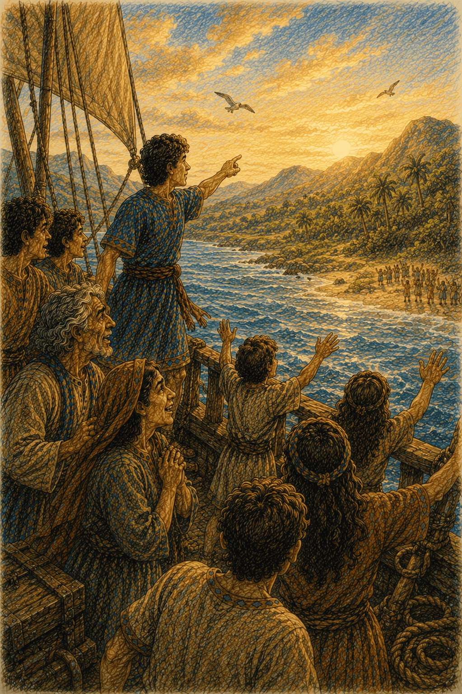 
  <em>The family rejoices aboard the ship as they finally spot the promised land after years of wandering.</em>

They ran the ship up onto the beach, and everyone tumbled out onto solid ground, laughing and crying and hugging. They fell to their knees in the warm sand and thanked God with all their hearts.

They had left the great city of Jerusalem. They had crossed a burning desert. They had faced Laban, and angels, and storms, and years and years of hardship.

And through all of it, one boy had held tight to the iron rod, and never once let go.

Nephi stood on the shore of the promised land, the sea breeze in his hair, his family gathered all around him.

He looked out at the beautiful new country God had given them.

He was home.

---

## The End

...of the *first* book of Nephi.

But it is only the beginning of Nephi's story — and of a great and wonderful people who would live in that promised land for a thousand years, and who wrote down everything that happened, so that one day *you* could read it, and remember, and hold to the rod, too.

---

### Things to Remember from Nephi's Story

- **"I will go and do."** When God asks us to do something hard, we can trust that He will make a way for us to do it — just like Nephi did.
- **Ask for yourself.** Nephi didn't just believe because his father believed. He prayed and found out for himself that it was true. You can, too.
- **Hold to the rod.** God's word — the scriptures and His commandments — is like an iron railing that leads us safely through the dark, all the way to God's love.
- **Faith makes small things powerful.** The Liahona was just a ball — but with faith, it led a whole family across the world. A little faith can do great things.
- **Choose to forgive.** Again and again, Nephi's brothers were unkind to him. And again and again, Nephi chose to forgive them, because he wanted to be like God.
